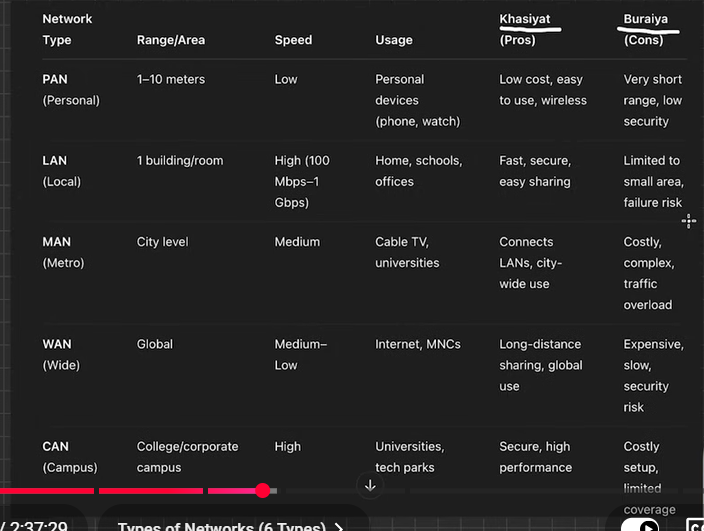
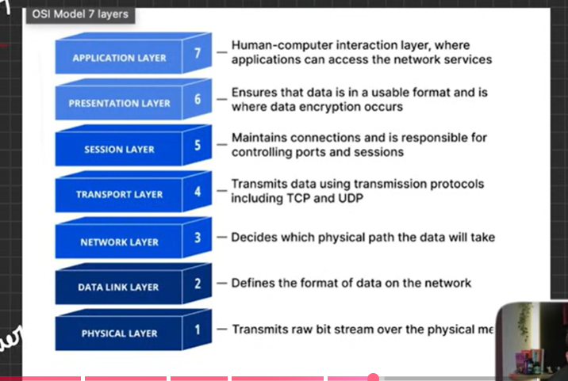
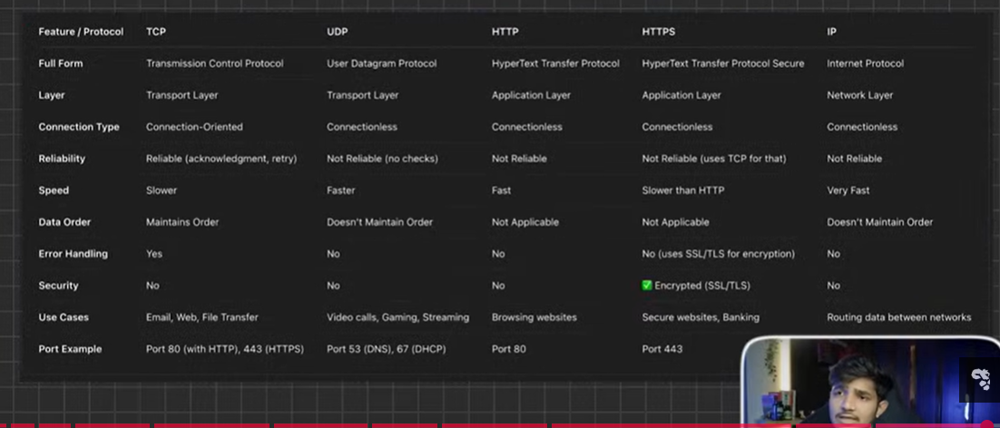

# COMPUTER NETWORKING
(Cleo Abram videos to know external internet working)

## How Internet Works?
- WW2 -> Cold War b/w Russia and US
- Founding Fathers of Internet = Vint Cerf and Bob Kahn
- 1983 -> TCP/IP
- 1990s -> www, http, html -> Tim Burnes Lee
- TP -> IPV4 (255.255.255.255 -> 4 places)
- DNS (Domain Name System) -> Like a Phn book -> ICANN provides DNS -> Every Every IP has DNS -> Eg. sart.sheryians.com (SubDomain.SecondLevelDomain.TopLevelDomain)

## How data is transferred?
- End-to-End Encryption
- 2.45 GHz -> Wider range but less speed
- 5 GHz -> less range but  Wider speed

* Applications (Whatsapp)
- Converts msg into Packets
- Encrypt msg

* IP Address -> IP (IPV4 and IPV6) and Port no.
- Port no. -> total 65,535 approx. -> 0 - 1023 are well known port or system ports -> 1023-49,151 are application ports -> 49151 - 65535 are temporary ports

* Router -> does 2 works:
- Receives msg
- NAT (Network Address Translation) -> our IP are private and not available on internet so NAT convert our IP to public IP so that anyone can use them

* ISP (Internet Service Provider)
- find shortest path

* Application Server (Whatsapp Server)

- User - Applications (Whatsapp) -> Router -> ISP

## IP Address and Post No.
- IP -> Internet Protocol -> rules
- Types - IPV4(32 bit, 4.3 billion combinations of IP, 4 places) and IPV6(0 - 9 and a - f, 3.4 x 10^38 combinations, 8 places)

## DNS
- DNS (Domain Name System) -> Like a Phn book -> Every Every IP has DNS -> Eg. sart.sheryians.com (SubDomain.SecondLevelDomain.TopLevelDomain)
- ICANN provides DNS
- .in , .uk , .us -> country domains
- .com -> commercial
- .org -> Non-profitable orgaanization
- .ai , .dev , .app -> niche domains

## Types of Network
 
- VPN (Virtual Private Network) = Encrypting own's ip so noone can know use other place IP

## Toologies
- Bus
- Ring
- Star
- Mesh
- Tree
- Hybrid

## OSI MODEL

- Open System Interconnection
- Developed by ISO company in 1984
- It is a standard model, not a protocol
- It is a conceptual framework that defines how data is transferred.
- Sender -> from Application to Physical (Top to Bottom)
- Receiver -> from Physical to Application (Bottom to Top)

## How Computers Communicate (Client - Server Architecture)
- Centralized Server

 ### Peer - to - Peer Architecture
 - DeCentralized Server
 - All devices are connected to each other but not connected to a centaralized server or any other server.
 - Security concers are there

 ### Protocols
 - Set of rules
 - Roles: - Data Ack, Resend and Ack, Data verification, data sending, Routing

 1. HTTP and HTTPS
 - Application protocols
 - HTTP -> port no. 80
 - HTTPS is a secured protocol -> HTTP +  Security -> Encryption of data -> Port no. 443
 - SSL / TSL encrypt the data in HTTPS

 ### IP (Internet Protocol)
 - Network layer protocol
 - To tell data its destination

### TCP (Transm)
- Transport Layer Protocol
- Data into packets
- Sequencing
- Ack
- Resend if not ACK
- Eg: Bank, E-commerce sites

### UDP (User Datagram Protocol)
-  Very fast
- No sequencing
- No ACK and resending data
- Eg: Video and voice call, Live, Games

